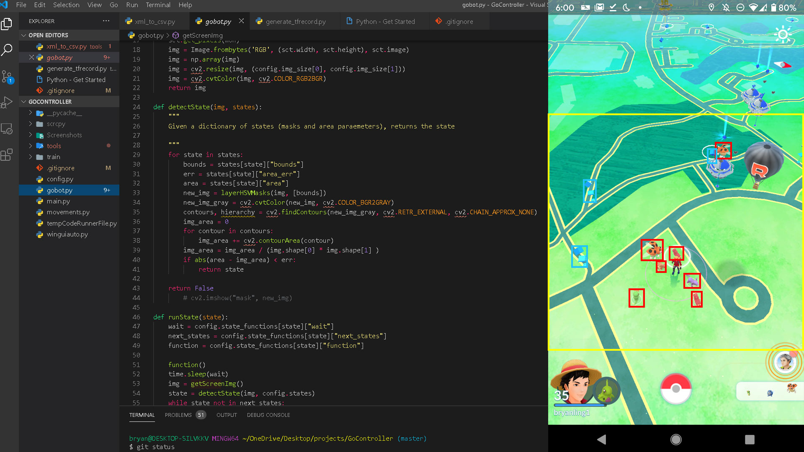
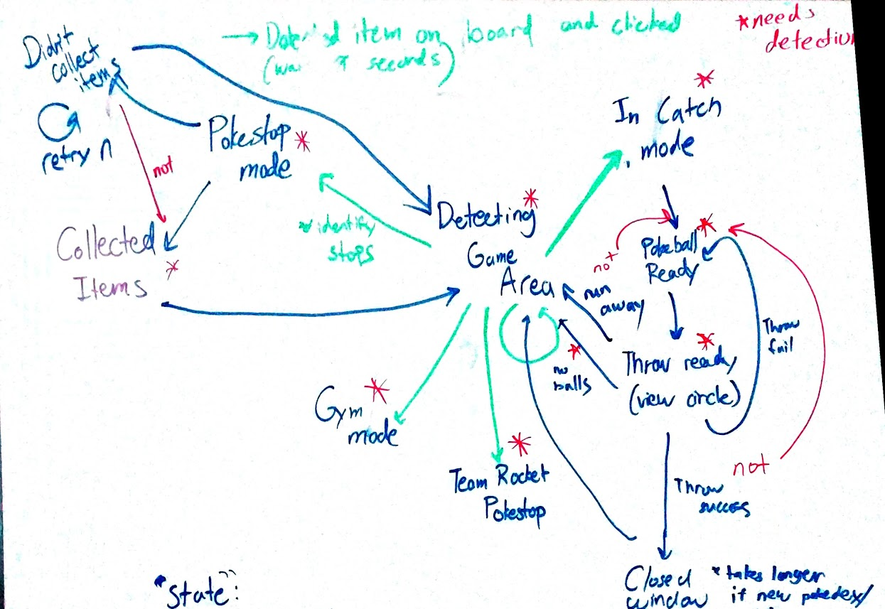

# Pokémon Go Walker: Computer Vision Script

This project uses machine learning techniques such as a convolutional neural network to detect
game state and Tensorflow's object detection API to detect the state of the game(which menu you are on).

The purpose of this script is to combine these techniques to automate the actions in the hit mobile game
Pokémon Go.

Tasks include identifying and selecing a Pokémon on the map to encounter, throwing a Poké-ball until capture/out of items, 
and spinning Poké-stops to replenish items being used in the process. 

It is understood that automating game tasks is against Niantic's policies and is merely for educational uses.

## Built With
- [Scrcpy](https://github.com/Genymobile/scrcpy)
- [OpenCV](https://opencv.org/links/)
- Tensorflow 2
- Python
- [Tensorflow's object detection API](https://github.com/tensorflow/models/tree/master/research/object_detection)

## General Program Flow
The script can be described as immitating a basic state machine. This is to allow for correction if an object is 
wrongly identified. Here is the current flow of the program:

## Installation
The Pokémon Go Walker scripts is run by first connecting your phone to your computer and connecting to [Scrcpy](https://github.com/Genymobile/scrcpy).

You will need to enable USB debugging (allow for screen tabs) and maximize the window before running the script

## Next Steps
- Implement updated object detection model to distinguish Pokémon gyms
- 
- Finish Installation guide on README

